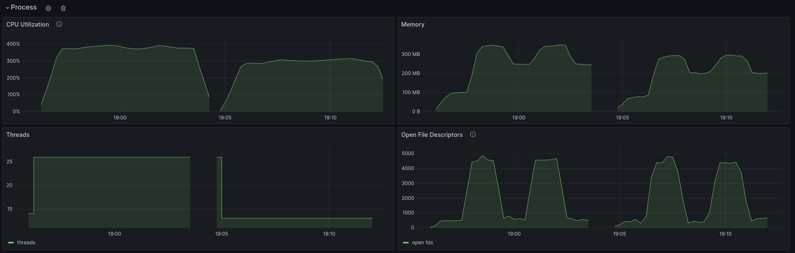

# NSuns

This is a dashboard for tracking my home gym workouts. Powered by Rust + SolidJS!

## Features

### Program Builder

Tailor a program to your preferences:


### Program Runner

Run a program you have built


## The Stack

### Backend

- PostgreSQL database
- Rust server with Axum
- OpenAPI and Swagger-UI at `/swagger-ui`
  - Can be conditonally bundled at compile time, and switched on/off with config
- Metrics exported for Prometheus
  - Can be disabled entirely via config (it introduces overhead per-request)
  - Exported on separate port so it can be kept private to a docker network or VPC
- Database migrations and operations with the sqlx crate

### Frontend

- SolidJS with TypeScript
- Tailwindcss styles
- Solid-Query for async state
- Global signals for client state
  - Example: currently selected day and set
  - Other client state is stored in the URL

SolidJS was chosen because it's fast and small, and this is intended to run on a Raspberry Pi. The previous iteration was a 4x larger bundle, had fewer features, and was generally too slow for the hardware.

## Development

This project uses [cargo-make](https://github.com/sagiegurari/cargo-make) to manage workflows. It must be installed with `cargo install cargo-make`.

Since this is intended to run on a raspberry pi 4, the compile target for the `rpi` profile is set to `aarch64-unknown-linux-gnu`. You must configure cargo to point to the linker for this architecture in order to compile. Create a file called ~/.cargo/config.toml and set the linker for this target:

```toml
[target.aarch64-unknown-linux-gnu]
# example for my system, installed with pacman
linker = "/usr/bin/aarch64-linux-gnu-gcc"
```

To get a list of cargo-make targets, use `cargo make --list-all-steps`.

### Metrics

The base docker-compose file includes services for monitoring the server. The grafana UI is accessible at http://localhost:3100. You can import some example dashboard definitions from `./config/grafana-dashboards`

Metrics include tracing, which is set up to record 10% of traces by default.


### Load Testing

Load testing can be performed with the `cargo make load-test` command. This will create a `load_test` database, start the server, and run k6 against it.

Metrics can be monitored while the load test is running. Example below to show the effect of enabling opentelemetry (enabled on the left):




In this case, the server container could not export the traces since it can't connect to the tempo instance (different docker network). You are seeing the overhead of trying to add unpublished spans to a full sync channel.
